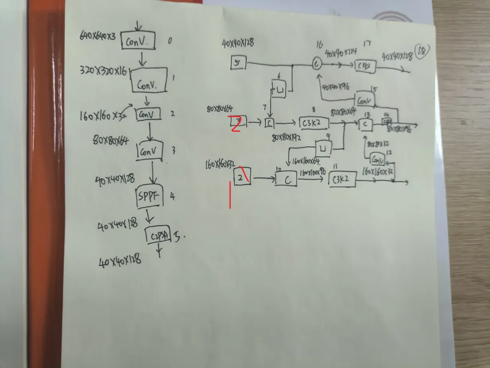
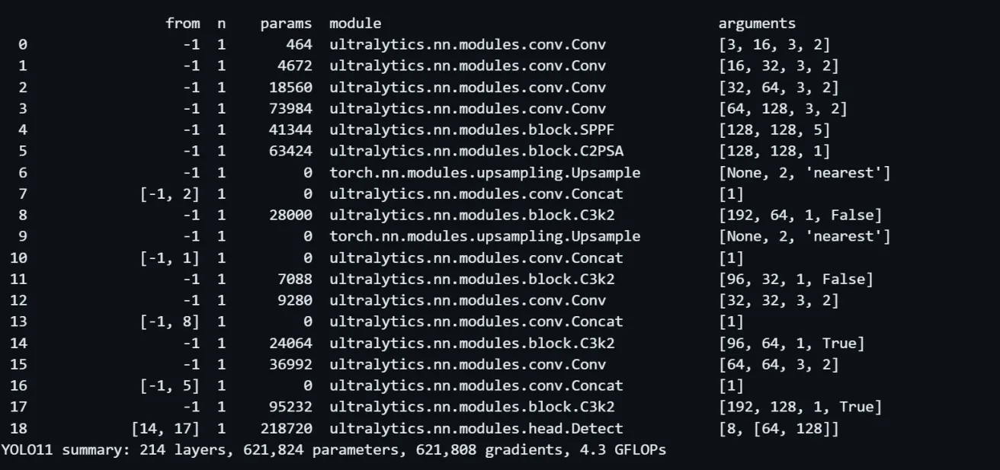
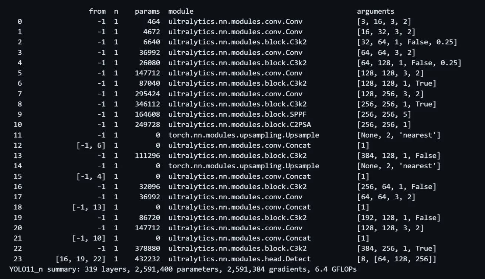
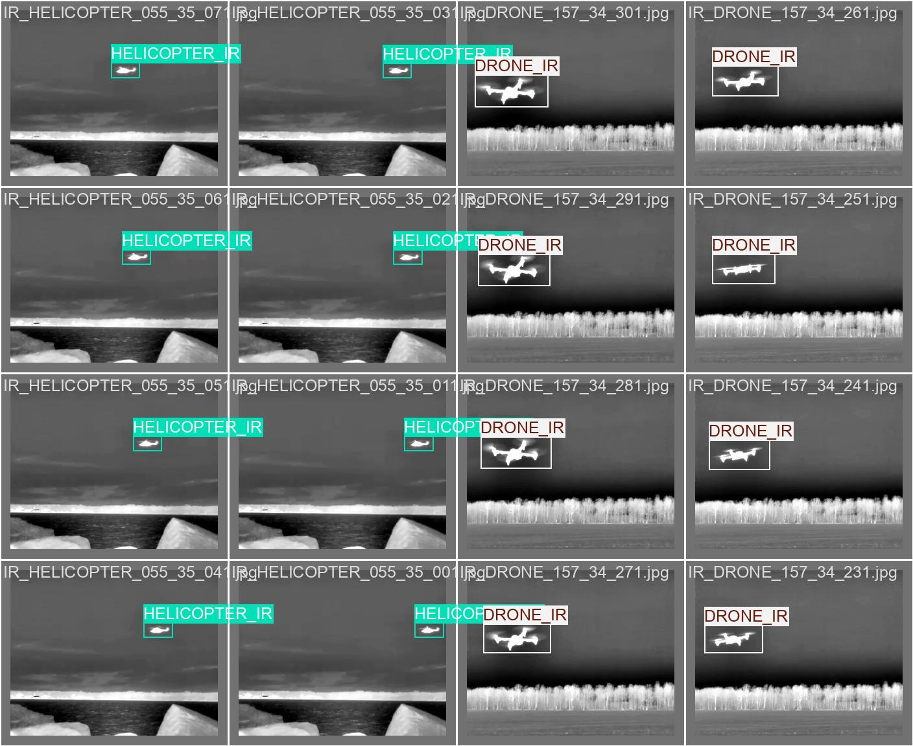
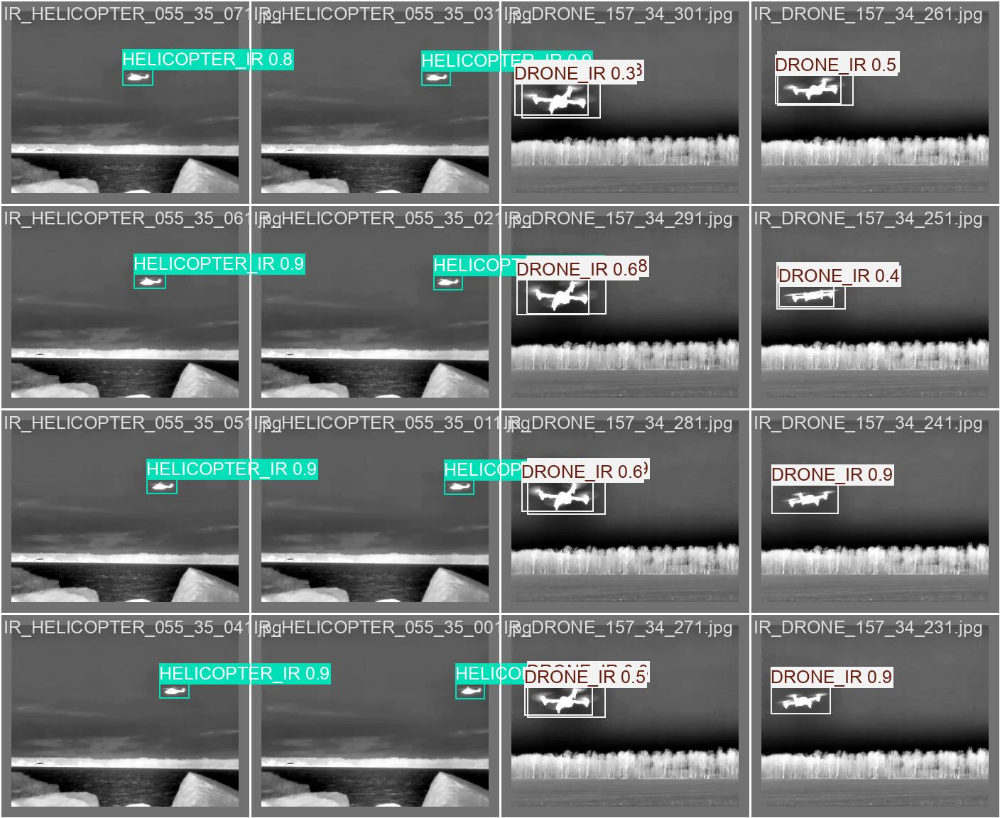
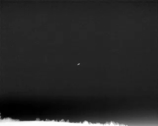
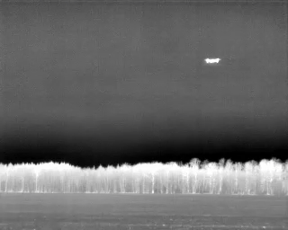

# Anti-UAV_colab💀💀💀

## 基于深度学习的无人机识别与追踪

如何使用:  **release下载发行版即可使用**

- 第一步:

    ```pip install ultralytics```

    ```pip3 install torch torchvision torchaudio --index-url https://download.pytorch.org/whl/cu126```

- 第二步:

    ```python 1_train.py``` 以开始训练

    ```python 2_val.py``` 以开始验证模型性能精度

    ```python 3_Predict.py``` 以开始检测图片或视频流

    ```python 4_tracking.py``` 以开始追踪目标,为不同目标分配不同ID以进行计数

精简的 yolov11_i 框架(适用于检测小目标)______修改自2024_9_27发布的[yoloV11](https://docs.ultralytics.com/)🥰🥰🥰

↓↓↓↓↓↓↓↓↓手画的修改结构图


↓↓↓↓↓↓↓↓↓打印出各层的具体模块


| 名称 |层数|参数量|梯度|GFLOPs
|-----|---|--------|--------|------
|i(自制)|214|621,808|621,808|4.3
|     n|319|2,624,080|2,624,064|6.6
|     s|319|9,458,736|9,458,736|21.7
|     m|409|20114688|20114672|68.5
|     l|631|25372160|25372144|87.6
|     x|631|56966176|56966160|196.0

可以看到,模型 i 在参数上相比 yolo_n 官方的模型精简了 **76.30%**,前向传播一次的计算量少了 **34.85%**

↓↓↓↓↓↓↓↓↓下图是 yolo 官方的模型结构


使用[谷歌colab](https://colab.research.google.com/)进行训练🤩🤩🤩
非常推荐使用,完全免费的 [英伟达T4 GPU](https://www.nvidia.cn/data-center/tesla-t4/),挂载谷歌云盘可避免每次上传数据集,不受限制的网络速度,pip非常快

数据集一览:

下图为真实标签



下图为预测标签





<https://github.com/user-attachments/assets/ce9fb183-e103-404c-8de8-50396ecd5829>

识别结果(错误将鸟识别为无人机😒😒😒,不过可以发现目标)

<https://github.com/user-attachments/assets/a9400275-4c3e-4295-b5ac-343f2c0593ec>

数据集友链:

- [Dataset containing IR, visible and audio data to be used to train drone detection systems.](https://github.com/DroneDetectionThesis/Drone-detection-dataset) 非常推荐使用,标注完整⭐⭐⭐⭐⭐)

    此数据集的数据处理代码:[原作者提供的一个处理脚本](https://github.com/DroneDetectionThesis/Drone-detection-dataset/blob/6598976ba1a5f5adf3f309b570254582f909c0f3/Data/Create_a_dataset_from_videos_and_labels.m)

    可使用如下脚本进行全部文件提取并生成yolo格式的标注文件 [抽帧并归一化标注.m](https://github.com/liushihowe/Anti-UAV_colab_git/blob/6c3b72415735c79f3b6e0fd91bcfe206a675f791/datasets/%E6%8A%BD%E5%B8%A7%E5%B9%B6%E8%BD%AC%E5%8C%96%E4%B8%BAyolo%E6%A0%87%E6%B3%A8%E7%9A%84%E6%A0%BC%E5%BC%8F.m))

    核心代码:

    ```matlab
    for cls_idx = 1:length(class_names)
        bboxes = trainingData.(class_names{cls_idx}){i};
        if ~isempty(bboxes)
            % 处理每个边界框 (MATLAB 可能返回多行)
            for j = 1:size(bboxes, 1)
                % 获取绝对坐标
                x = bboxes(j,1);
                y = bboxes(j,2);
                w = bboxes(j,3);
                h = bboxes(j,4);
                
                % 转换为归一化坐标
                x_center = (x + w/2) / img_width;
                y_center = (y + h/2) / img_height;
                norm_w = w / img_width;
                norm_h = h / img_height;
                
                % 写入文件 (格式: class_id x_center y_center width height)
                fprintf(fid, '%d %.6f %.6f %.6f %.6f\n',...
                    class_dict(class_names{cls_idx}),...
                    x_center, y_center, norm_w, norm_h);

                % fprintf(fid, '%d %.6f %.6f %.6f %.6f\n',...
                %     0,...
                %     x_center, y_center, norm_w, norm_h);

            end
        end
    end
    ```

- [2025CVPR第四届反无人机研讨会](https://anti-uav.github.io/)
- [科学数据银行_地/空背景下红外图像弱小飞机目标检测跟踪数据集](https://www.scidb.cn/detail?dataSetId=720626420933459968)

    (此数据集只标注目标的中心点)
- [无人机与鸟类检测](https://www.mdpi.com/1424-8220/21/8/2824)
- <https://arxiv.org/abs/1612.00192>
- [🔥🔥Official Repository for Anti-UAV🔥🔥](https://github.com/ZhaoJ9014/Anti-UAV)

已放弃的想法:

~~在yolo后加个transformer模块,当某张图片的置信度小于某个阈值时启用,既能增强检测准确度,又能在不需要的时候节约资源~~

~~对于视频帧来说,可以通过前一帧和后一帧来预测当前帧,对于这种小目标检测应该会很有用~~
